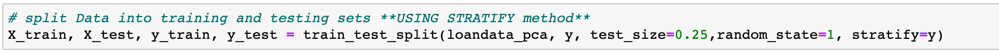
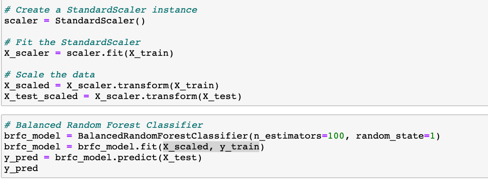
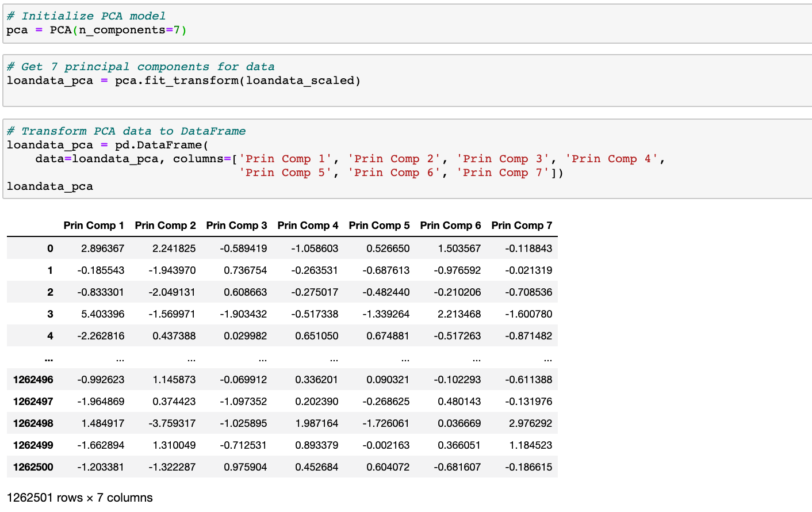

## Presentation
We created a presentation that outlines our project, the link to access the presentation in Google Slides is: https://docs.google.com/presentation/d/1wl5fh1hy7INwmN3SFGhOb3SmR-6gdZKuIa7i79OaafM/edit?ts=5fe9341f#slide=id.gb622606d37_0_5

Our presentation’s first slide, first_slide.png, describes our topic, predicting loan status, and the justification for choosing it, as well as questions we wanted answered. It contains a flow chart, Flow_chart.png, demonstrating the data’s journey and the programs used to change it, beginning as a Kaggle CSV from lending club, and ending in either python for machine learning or Tableau for visualization. The analysis uses the same model but varies how many columns are included. It shows inconclusive variation between precision, recall, and f1-score, but a general accuracy score increase with fewer columns. Finally, the presentation includes several visualizations taken from our dashboard.

## Github
We have used GitHub to as a way to store and share our work for this project. Currently on GitHub we have 5 branches. We have a branch for each member of the project as well as a Master Branch. The Master Branch contains all of the work that goes into the final project along with a README.md file that contains descriptions required in all other project deliverables and each task preformed to come to a final project. 

## Machine Learning Model

### Preliminary data preprocessing
We performed extensive preliminary data preprocessing to prepare our dataset to function properly in Machine Learning models, including:

* We filtered our dataset on “loan_status” column, dropping all categories except “Fully Paid” & “Charged Off” to create a “good loan vs. bad loan” column ( we exclude data pertaining to loans that are in repayment to focus only on the loans where the outcome is known, either “Fully Paid” (good loans) or “Charged Off” (bad loans))

* We learned from our data exploration that the loan dataset contained a large amount of missing values, so we dropped all columns that were missing over 100,000 values

* We used the “data dictionary” from Lending Club to learn about each column of data and used this resource and subject matter expertise to drop duplicate data columns, text and date data columns that are not usable in ML models, as well as data columns that would not be known before a loan is approved and being serviced
* We dropped missing values or “na”s from dataset using Panda’s “dropna” method
* We transformed non-numeric categorical data to dummy variables with Panda’s “get_dummies” method

### Preliminary feature engineering and preliminary feature selection
Since our raw dataset contained a very large amount of variables (151 columns), we performed feature engineering to reduce the quantity of features to include in our ML models. We had already eliminated features with large amounts of missing data as well as eliminating redundant or duplicate data features, and further refined our dataset by removing features that do not provide data relevant to making predictions about credit risk. We then used Principal Component Analysis (PCA), a statistical technique to optimize ML models by reducing the input features by transforming a large set of variables into a smaller one that contains most of the information in the original large set.
The features determined by our feature reduction process represent information about a borrower’s Credit score, Annual Income, Debt-to-Income Ratio, Loan Amount, Total Credit Revolving Balance, Revolving line utilization rate (the proportion of credit the borrower is using relative to all available revolving credit)

 

### Determining training and testing datasets
We split our data into training and testing sets, using scikit-learn’s “train_test_split” method, and used the default split of 75% of data for model training and 25% of data for model testing. Additionally, we use the 'stratify=y' argument which locks the distribution of classes (good loans vs. bad loans) in our 'train' and 'test' sets in order to get a similar distributions between classes.

### Model choice, limitations and benefits
We ran several types of Machine Learning models on our preprocessed Lending Club dataset, including Logistic Regression, Decision Trees, Easy Ensemble Classifiers and Balanced Random Forest Classifier models. We focus BRFC Supervised Machine Learning models because they are suited to make classification predictions, as well as their robustness and ability to handle large amounts of data- and especially because these types of models are meant to work on imbalanced data, (as our dataset has a slight to moderate imbalance- we have about 4 times as many 'good' loans as 'bad' loans). We utilize the 'StandardScaler' since our data contains features that vary widely in magnitudes, units and range. Applying scaling to our features reduces the machine learning algorithms' tendency to weigh greater values, higher and consider smaller values as the lower values, regardless of the unit of the values or the range they cover.

* We added PCA to our BRFC model (between Segment 2 and Segment 3 deliverables) to reduce the dimensions (columns) we feed into the model and increase the model accuracy and reduce the differences in Precision and Recall between 'good' and 'bad' loan classes. 

We iterated over different combinations of features and Principal Components, using the 'Feature Importance' ranking to select the features with the highest importance ratings. Our final BRFC model uses PCA on 15 features to transform down to 7 Principal Components.

#### Training & Testing model
* We trained our model on 75% of the cleaned and preprocessed loan data (946,875 rows ) and tested the model on 25% of loan data (315,625 rows of data). 
    
#### Accuracy Scores
The successive models we built, trained and tested produced accuracy scores that increased from 0.49 (when we used 46 vaiables reduced to 10 Principal Components) 

to 0.549 Accuracy when using 15 variables to reduce down to 7 Principal Components.

The Precision and Recall and F1 Scores for minority and majority classes does not vary very much between model iterations, typically showing better scores for the majority class '1' which represent 'good loans' or those 'Fully Repaid'.

While our model does not produce as high an accuracy score as we would have liked, we were able to improve the accuracy score by iterating through feature engineering, and modifying the amount of variables and Principal Components we feed into the model. This model predicts whether a loan is likely to be Fully Repaid or Charged Off with slightly better than half the time (0.549) and should have some utility in predicting good vs. bad loans at lending institutions. 

## Dashboard
The dashboard built in tableau shows the relationships of a combination of variables through various charts and graphs. The dashboard shows the difference between charged off and paid for loans compared to several other variables so we can dive a little deeper on what the difference between these two types of loans. We used StandardScaler since our data has wide ranges for multiple variables. This reduces the machine learning’s inclination to put more emphasis on the greater values and less emphasis on the lesser values regardless of the values and the range they cover. You can see how variables change over time and how two variables are directly correlated to each other.